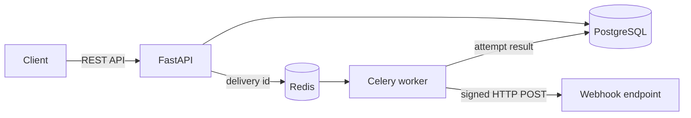

# Webhook Delivery Platform

Сервис надёжной асинхронной доставки webhook-событий. Клиент регистрирует HTTP-endpoint и подписки, публикует событие, а платформа создаёт отдельную доставку для каждого получателя, подписывает запрос и сохраняет историю всех попыток.

## Возможности

- маршрутизация по типу события и wildcard-подписки `*`;
- фоновая доставка через Celery и Redis;
- HMAC-SHA256 подпись каждого запроса;
- идемпотентное создание событий через заголовок `Idempotency-Key`;
- повторные попытки для `408`, `429`, `5xx` и сетевых ошибок;
- exponential backoff с jitter и dead-letter состояние после исчерпания попыток;
- защита от повторной отправки уже завершённой доставки;
- журнал HTTP-кодов, ответов, ошибок и длительности каждой попытки;
- отключение и повторное включение endpoint, ротация секрета;
- health checks, интерактивная OpenAPI-документация и CI.

## Стек

Python 3.13, FastAPI, PostgreSQL, SQLAlchemy 2, Alembic, Celery, Redis, HTTPX, Pydantic, Pytest, Ruff, Docker Compose.

## Архитектура



Создание события и всех связанных доставок происходит в одной транзакции. Worker атомарно переводит доставку в `processing`, выполняет подписанный HTTP-запрос и сохраняет результат. Временная ошибка планирует новую попытку с увеличивающейся задержкой.

## Быстрый запуск

Требуется только Docker с поддержкой Compose:

```bash
docker compose up --build
```

После запуска доступны:

- Swagger UI: <http://localhost:8000/docs>
- OpenAPI: <http://localhost:8000/openapi.json>
- readiness check: <http://localhost:8000/health/ready>

Миграции применяются автоматически перед запуском API. PostgreSQL и Redis сохраняют данные между перезапусками.

Управляющие API защищены ключом. В Swagger UI нажмите **Authorize** и введите демонстрационное значение `demo-api-key`. Health checks и тестовые webhook-получатели доступны без ключа. Для настоящего развёртывания обязательно замените `API_KEY` и `TEST_WEBHOOK_SECRET`.

Остановить сервисы:

```bash
docker compose down
```

Чтобы также удалить демонстрационные данные:

```bash
docker compose down --volumes
```

## Демонстрационный сценарий

Все шаги удобно выполнить в Swagger UI.

1. Создать проект через `POST /projects`:

   ```json
   {"name": "Demo shop"}
   ```

2. Создать endpoint через `POST /endpoints`, подставив `project_id`:

   ```json
   {
     "project_id": "PROJECT_UUID",
     "url": "http://api:8000/test/webhook/success"
   }
   ```

   Секрет возвращается только при создании или ротации endpoint. В реальной интеграции получатель хранит его безопасно и использует для проверки подписи.

3. Подписать endpoint через `POST /subscriptions`:

   ```json
   {
     "endpoint_id": "ENDPOINT_UUID",
     "event_type": "payment.completed"
   }
   ```

4. Опубликовать событие через `POST /events`, указав заголовок `Idempotency-Key: payment-42-completed`:

   ```json
   {
     "project_id": "PROJECT_UUID",
     "event_type": "payment.completed",
     "payload": {
       "payment_id": 42,
       "amount": 4990,
       "currency": "RUB"
     }
   }
   ```

5. Открыть `GET /events/{event_id}/deliveries`, а затем `GET /deliveries/{delivery_id}/attempts`. Успешная доставка получит статус `success` и HTTP-код `200`.

Для демонстрации retry-политики зарегистрируйте второй endpoint с URL `http://api:8000/test/webhook/error`. Он отвечает `500`, поэтому интервалы между попытками будут расти, а после исчерпания повторов доставка перейдёт в `dead`. Её можно повторно поставить в очередь через `POST /deliveries/{delivery_id}/retry`.

## Формат исходящего webhook

```http
POST /webhook HTTP/1.1
Content-Type: application/json
X-Webhook-Id: <event UUID>
X-Webhook-Delivery: <delivery UUID>
X-Webhook-Timestamp: <Unix timestamp>
X-Webhook-Signature: <HMAC-SHA256>
```

```json
{
  "id": "EVENT_UUID",
  "type": "payment.completed",
  "created_at": "2026-09-05T12:00:00+00:00",
  "data": {
    "payment_id": 42,
    "amount": 4990,
    "currency": "RUB"
  }
}
```

Подписывается строка `<timestamp>.<raw request body>` секретом endpoint. Для сравнения подписей следует использовать constant-time функцию, например `hmac.compare_digest()`.

## Локальная разработка

Создайте `.env` из `.env.example`, запустите PostgreSQL и Redis, затем:

```bash
pip install -e . pytest pytest-asyncio ruff
alembic upgrade head
uvicorn app.main:app --reload
```

Worker запускается отдельно:

```bash
celery -A app.workers.celery_app:celery_app worker --loglevel=INFO
```

Проверки:

```bash
ruff check .
pytest
```

## Статусы доставки

| Статус | Значение |
|---|---|
| `pending` | доставка создана и ожидает worker |
| `processing` | HTTP-запрос выполняется |
| `retrying` | временная ошибка, назначена новая попытка |
| `success` | получен успешный `2xx` ответ |
| `dead` | постоянная ошибка или исчерпаны повторные попытки |

Дополнительные схемы находятся в [docs/architecture.md](docs/architecture.md) и [docs/database.md](docs/database.md).
